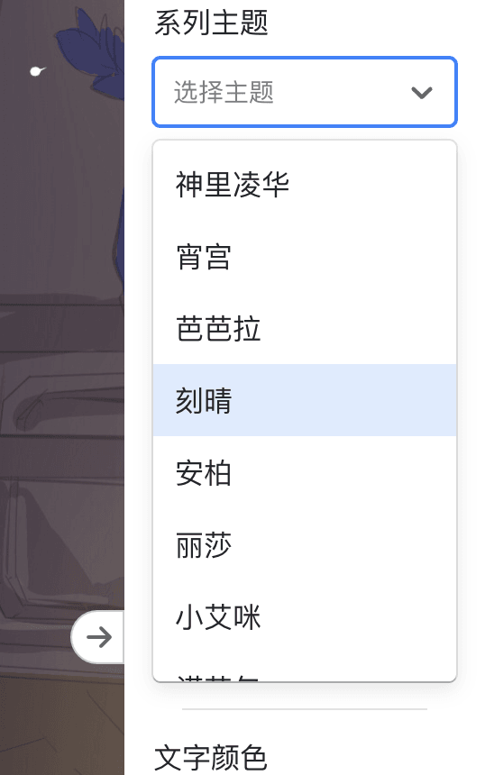
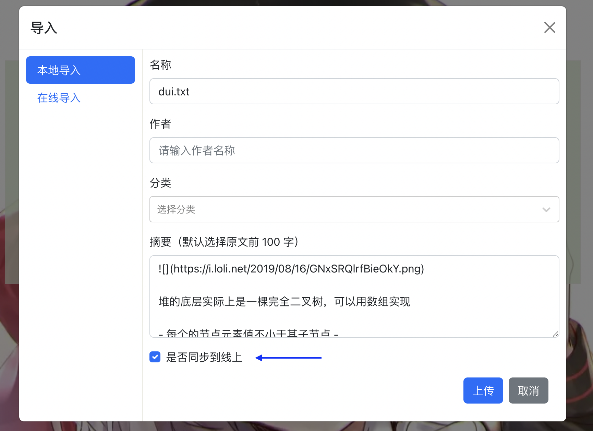
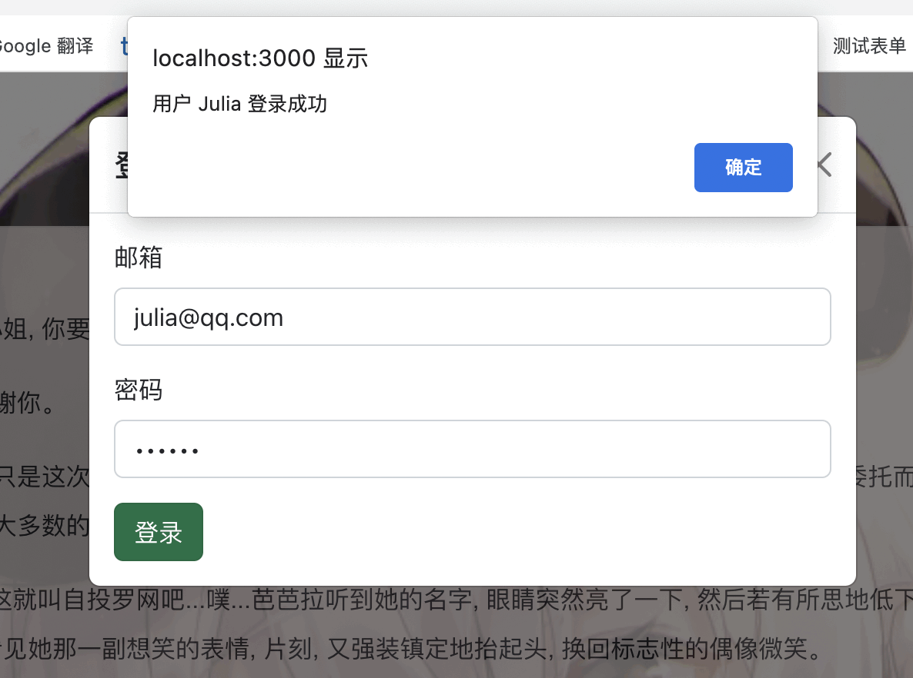
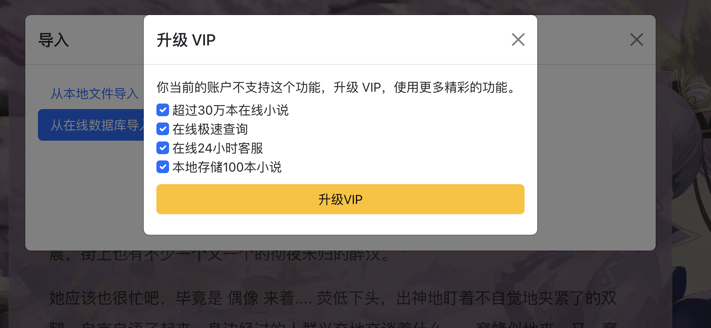

# 原神主题小说阅读器设计与实现

## 0 前言

当前很多小说阅读器，支持用户定制的样式很少，背景色缺少，不是很方便阅读。

我个人喜欢阅读小说，并且希望有丰富的背景和自定义样式，所以尝试自己实现了一个简单的小说阅读器，支持丰富的原神背景主题，支持用户高度定制阅读界面，同时有简单的服务器搜索，用户管理等基本功能，以搭配前端阅读器使用，同时也熟悉巩固各种技术等。

正好 2023 年春节期间有时间，差不多前后用2个月时间，完成了这个小项目的 1.0 版本。

关键词：React；MySQL；Express；ReactStrap；Genshin

## 1 软件功能

### 1.1 离线模式

核心功能是纯文本小说阅读应用，包括用户上传小说，分章节视图，分页面视图，自定义页面样式（文字颜色，文字粗细，整体色调，背景颜色），支持了很多可爱的卡通背景图片。

整体界面左中右布局

左侧导航栏：支持本地上传，或者在线搜索文档，并以列表形式展示；另一个 tab 是不同章节的树状图展示

中间阅读栏：预览模式（全页模式，分页模式，全屏模式）

右侧设置栏：可以切换 tab，分别是基本设置和高级设置


### 1.2 在线模式

在离线模式基础上，1.0 版本支持用户操作：用户登录，用户注册，后台管理等功能；支持小说操作：在线搜索小说，下载小说，上传小说等功能。


### 1.3 细节功能

左侧切换大纲和分页，右侧设置基本样式和阅读模式。


设置栏可以支持拖动改变宽度，效果如下


点击下方派蒙，可以返回到顶部


不同主题原神主题色系



支持本地上传到数据库



支持初步用户登录和验证



支持全屏模式和快捷键阅读


支持不同权限管理



其他具体实现和项目排期比较多，所以放在线上了

链接：https://cloud.seatable.cn/dtable/external-links/7995693695bc430db4f3/

### 1.4 未来功能展望

这里是表格中待完成任务列举出来

#### 1.4.1 前端功能扩展

[前端] 报错信息优化

[前端] 背景水印

[前端] 本地存储阅读记录

[前端] 登录页面单页面

[前端] 支持多页面

[前端] 分页分章节

[前端] 付费界面改进

[前端] 界面按钮组件主题色统一

[前端] 使用帮助

[前端] 大文件性能问题

[前端] 支持多语言切换

[前端] 支持图片验证码

[前端] 左侧侧边栏支持隐藏

[前端] 左侧支持搜索

[前端] React hooks 优化全部的类组件

[前端] react-redux 或者 mobx 实现状态管理

[前端] token 存储在本地

[前端] TS 语言重构项目

[前端] VUE 语言重构项目

#### 1.4.2 后端功能扩展

[后端] 代码分离

[后端] 服务器性能问题

[后端] 搜索逻辑优化

[后端] 微信扫码登录

[后端] 下载次数和时间统计

[后端] 用户密码数据库加密

[后端] express 框架构建

[后端] express 优化

[后端] flask 框架重构项目

#### 1.4.3 产品功能调研

[产品] 调研其他产品的界面

[产品] 界面统计

[产品] 云服务器调研

[产品] 支持不同版本

[产品] 支持导出

[产品] 支持导入导出 pdf

[产品] 支持二维码分享

[产品] 支持付费功能

[产品] 支持移动端界面

如果是离线状态，打开对话框，提示”网络连接失败，以离线模式进行预览“。如果是在线状态，打开对话框，提示”用户登录或注册“，如果登录不正常，就是游客模式。如果登录正常，根据数据库判断，是免费版本，还是 VIP 账户，还是 admin 账户。

模式和权限列表，目前支持离线模式，免费模式。

| 模式     | 字段    | 网络状态 | 登录状态 | 本地上传 | 小说数量 | 在线查询 | 高级设置 | 用户管理 |
| -------- | ------- | -------- | -------- | -------- | -------- | -------- | -------- | -------- |
| 离线模式 | offline | 断网     | 未登录   | √        | 3        | x        | x        | x        |
| 游客模式 | tourist | 联网     | 未登录   | √        | 3        | x        | x        | x        |
| 免费模式 | free    | 联网     | 已登录   | √        | 10       | x        | x        | x        |
| VIP 模式 | vip     | 联网     | 已登录   | √        | 不限     | √        | √        | x        |
| 管理     | admin   | 联网     | 已登录   | √        | 不限     | √        | √        | √        |

#### 1.4.4 大数据和推荐功能扩展

[后端] 根据用户阅读列表，使用推荐算法，给用户推荐想要的小说

#### 1.4.5 用户调研和反馈

[测试] 全部功能样式测试

[文档] 完善使用文档

[文档] 注释分支

[运营] 线上反馈

限于时间和精力，第一版目前先做到这里，后续再完善其他功能


## 2 主要技术和工具

### 2.0 环境配置

本章节介绍在开发过程中所应用到的主要技术和环境需求：

操作系统：MacOS 12.4

硬件配置：8G 内存 + 256G 硬盘

开发环境：服务器 nodejs 19.0.1 浏览器 Google Chrome 110.0

开发语言：Javascript

开发框架：React 18

开发工具：Visual Studio Code 1.76.1

网络工具：Postman Version 10.9.4

数据库：Mysql

数据库管理工具：Table plus Version 5.3.4

设计工具：及时设计	<https://ad.js.design/special/sketch/> 


产品工具：墨刀工具	<https://modao.cc/app/design/pblctvmjxgcwolda?> 

图标工具：阿里巴巴图标库：<https://www.iconfont.cn/collections/index> 

图标工具：iconmoon图标库：<https://icomoon.io/#icons-icomoon>


2.1 [前端技术](./2.1-frontend.md)

### 2.1 前端技术点

#### 2.1.1 前端框架 React

本项目使用 React 18 版本，React 主要用于数据展示到界面。

#### 2.1.2 UI 组件库

本项目使用 reactstrap 作为 UI 组件库，样式主题色引用 bootstrap 的样式，具体版本如下。

~~~
"bootstrap": "^5.2.3",
"reactstrap": "^9.1.5",
~~~

reactstrap 组件库和 bootstrap 组件库样式类似，且和 react 框架结合良好，日常使用较多，API 和配置较熟悉，所以选择这个作为组件库，减少了从零开始写 UI 组件消耗的时间成本。

#### 2.1.3 状态管理

1、小说内容数据：支持本地上传，或者从服务器搜索加载两种模式。离线模式可以本地上传，上传后以 state 形式保存在 app 中。在线模式中，支持从服务器中查找小说并加载，可以把本地小说上传到服务器。

2、界面样式数据：支持自定义背景图片，背景色，字号，字体，文字颜色，行间隔，保存本地在浏览器存储中。

3、阅读模式数据：模式分为全屏模式、分页模式、章节模式，适合不同类型的小说或者阅读者的需求，界面渲染不同模式的组件。

因为项目数据不复杂，目前使用 React state 进行数据管理，没有使用额外的数据管理库（redux 或者 mobx），未来考虑使用 context、mobx 或 redux 进行状态管理。

#### 2.1.4 移动端

目前使用 react-responsive 实现移动端媒体查询，具体移动端 UI 效果和功能待实现。

#### 2.1.5 其他工具库说明

本项目还使用了其他第三方工具库，简介如下：

~~~
"axios": "^1.2.2" 发送网络请求
"classnames": "^2.3.2", 处理css类名
"deep-copy": "^1.4.2", 深拷贝对象
"is-hotkey": "^0.2.0", 键盘快捷键
"lodash": "^4.17.21", 扩展JS方法
"react-color": "^2.19.3", 自定义颜色选择器
"react-router-dom": "^6.8.1", 浏览器界面路由
"react-scripts": "5.0.1", react开发脚本工具
"react-select": "^5.7.0", 选择框组件
"react-sweet-progress": "^1.1.2", 进度条组件
"react-transition-group": "^4.4.5", 动画效果组件
~~~

构建打包工具是 webpack，集成在 react-scripts 库中

~~~
// babel es6 转换器
"@babel/cli": "^7.5.0",
"@babel/core": "^7.5.0",
"@babel/node": "^7.5.0",
"@babel/plugin-proposal-class-properties": "7.14.5",
"@babel/plugin-transform-modules-commonjs": "^7.5.0",
"@babel/plugin-transform-runtime": "^7.8.3",
"@babel/preset-env": "^7.5.0",
"@babel/register": "^7.4.4",
"@babel/runtime": "^7.8.3",
"babel-eslint": "10.1.0",
"babel-jest": "27.0.2",
"babel-loader": "8.2.2",
"babel-register": "^6.26.0",

// 代码格式检查工具
"eslint": "^7.32.0",
"eslint-config-airbnb-base": "14.2.1",
"eslint-plugin-import": "2.25.2",

"form-data": "^2.5.1", APIpost表单数据工具
"jsdoc-to-markdown": "^7.1.1" 自动生成文档工具
"localforage": "^1.10.0", 前端存储工具
"match-sorter": "^6.3.1", 数组处理工具
"multer": "^1.4.5-lts.1",
"glamor": "^2.20.40",
"sort-by": "^1.2.0",
"web-vitals": "^2.1.4"
~~~


2.2 [后端技术](./2.2-backend.md)

### 2.2 后端技术点

#### 2.2.1 服务器

使用 express 作为后端，目前仅考虑基本的 RestAPI 请求，不考虑性能问题（高并发，负载均衡）。

~~~
"express": "^4.18.2",
~~~

#### 2.2.2 第三方库

- body-parser - node.js 中间件，用于处理 JSON, Raw, Text 和 URL 编码的数据
- cookie-parser - 解析 Cookie 的工具。通过req.cookies可以取到传过来的cookie，并把它们转成对象
- multer - node.js 中间件，用于处理 enctype="multipart/form-data"（设置表单的MIME编码）的表单数据
- "log4js": "^6.7.1", 日志记录工具
- "jsonwebtoken": "^9.0.0", 处理 JWT 工具库
- "express-jwt": "^8.4.1", 处理 express jwt 工具库

#### 2.2.3 参考链接

express 官方文档：https://www.expressjs.com.cn/starter/hello-world.html

express 基本使用：https://michael18811380328.github.io/backend/site/nodejs/20-Node.js%20Express%20%E6%A1%86%E6%9E%B6/


### 2.3 数据库设计

一个新开发的程序，需要有数据库的配合。MySQL是一种关系数据库管理系统，它最明显的机制就是将有关联的数据各个建表，多个表格通过不同的MySQL语句实现对数据的增删改查，几个表格在一起相辅相成，分工明确。整体条理清晰，加快了速度并且提高了灵活性。

这里使用 MySQL 数据库，版本为 "mysql": "^2.18.1"，实现基本的增删改查，目前不考虑性能安全等问题。

本地需要新建数据库，数据库名：novel，新建数据库表1-用户表，数据库表2-书籍表，具体建表语句参考

```
mysqldump -u root -proot --skip-add-locks --skip-add-drop-table --skip-comments novel  > sql/mysql.sql
```

参考链接

nodejs 连接 mysql: https://michael18811380328.github.io/backend/site/nodejs/24-Node.js%20%E8%BF%9E%E6%8E%A5%20MySQL/

tablePlus 数据库软件连接本地 mysql：https://blog.csdn.net/weixin_41697143/article/details/119904196

### 2.4 测试

软件测试的目的主要是发现软件缺陷和漏洞，其次，软件测试能够识别图书风险。为开发人员和程序经理提供软件测试的反馈结果，为风险评估提供必要的信息。再者，软件测试确保在上线日前达到上线标准。包括持续追踪图书进度和严格把控各个开发阶段的产品质量。

本地使用 Jest 实现前端单元测试；因为功能在不断完善中，目前只完成工具函数的单元测试，没有处理 React 组件的镜像测试，E2E 测试等，使用如下的测试工具和版本号。

~~~
"@testing-library/jest-dom": "^5.16.5",
"@testing-library/react": "^13.4.0",
"@testing-library/user-event": "^13.5.0",
~~~

未来有需要再完成 api 和组件的测试。

### 2.5 项目文件架构说明

#### 2.5.1 整体结构
~~~
├── README.md
├── backend 后端代码
├── dist 打包后的后端文件
├── build 打包后的前端代码
├── docs 文档
├── example 案例
├── img 图片资源
├── node_modules 第三方依赖
├── novel-server.log 后端日志
├── public 公共文件
└── src 前端代码
~~~


#### 2.5.2 前端结构

~~~
├── App.js 项目主文件
├── api 接口
│   └── local-api.js
├── common 公共组件
│   ├── icons
│   ├── scroll-top-button
│   ├── vip-button
│   └── vip-dialog
├── css 公共样式
│   ├── App.css
│   ├── common.css
│   └── font.css
├── index.js 入口文件
├── main 主页
│   ├── folded-icon 折叠设置栏图标
│   ├── long-page 长页面展示
│   └── short-page 分页展示
├── navs 左侧导航栏
│   ├── add-novel-dialog
│   │   ├── load-from-local
│   │   └── load-from-server
│   ├── nav-body
│   ├── nav-footer
│   └── nav-header
├── settings 右侧设置栏
│   ├── advance-settings 高级设置
│   │   ├── advance-theme-settings
│   │   ├── color-settings
│   │   ├── font-settings
│   ├── basic-settings 基本设置
│   │   ├── font-settings
│   │   └── theme-settings
│   ├── constants.js
├── test 单元测试
└── utils 工具函数
    ├── example.json 实例小说文件
    └── index.js
~~~

#### 2.5.3 后端结构

~~~
├── app.js 入口文件
├── connect.js 功能函数（暂不支持）
├── db-helper.js 数据库函数
├── http-server.js 后端路由
├── logger.js 日志函数
└── sql
    └── mysql.sql 数据库文件
~~~


## 3 开发过程

### 3.1 开发问题及解决

- 某些 css 文件不生效：检查文件路径没有问题。把这部分代码拷贝到其他能用的代码中，不生效，检查是类名写错了。
- reactstrap 样式不生效：没有引入 bootstrap.min.css 类
- 请求跨域：前端和后端端口号不一致，目前后端设置允许跨域

~~~js
app.all("*", function (req, res, next) {
	res.header("Access-Control-Allow-Origin", "*"); // 允许跨域
	res.header("Access-Control-Allow-Headers", "content-type");
	res.header("Access-Control-Allow-Methods", "DELETE,PUT,POST,GET,OPTIONS");
	if (req.method == 'OPTIONS') {
		res.sendStatus(200);
	} else {
		next();
	}
});
~~~

- 数据库端口号冲突：默认 mysql 的端口号是 3306 端口，如果本地装有多个 mysql 数据库，例如 docker 内部也跑的一个，可能造成另一个无法正常启动。实际环境中不可能有两个 mysql 在不同的端口跑。所以可以本地只开发一个项目，或者临时改一下数据库的端口号等。
- node 不支持 ES6 语法：运行服务前，需要用 babel 编译成 es5 后才能执行
- 发送请求时，数据库报错：错误日志如下，报错是服务器返回了多个响应，应该返回一个值 res.send(data)，然后 return 参考：https://blog.csdn.net/qq_48009509/article/details/121625588

```
/novel-reader/node_modules/mysql/lib/protocol/Parser.js:437
throw err; // Rethrow non-MySQL errors
Error: Cannot set headers after they are sent to the client at new NodeError (node:internal/errors:393:5)
```
- 数据库存储小说会不会太长：查阅数据库资料，logntext 字段的长度足够长，存放一个 10MB 的小说也绰绰有余。执行查询语句时，可以不返回小说详情，先返回小说的标题等信息，这样查询的速度回更快。
- 静态资源引用路径：静态资源（图片、字体文件）是否需要打包到 JS 中？目前图片已经打包，但是字体图标没有打包，未来图片是否存在无法显示的问题等？
- 数据库分页查找：如果想加载某个章节的数据，能否从 longtext 字段中返回指定的字符串，不需要一次性返回全部的页面
- token 如何在不同页面传参：登录页面验证后，如何在不同页面传参，目前使用 url search 参数传递 token。未来考虑 session 和 单点登录等技术

### 3.2 更新日志

#### 0.1（2023-01-14）

- [前端] 初始化项目前端
- [后端] 初始化项目后端
- [前端] 支持用户上传删除文件
- [前端] 支持基本设置和高级设置
- [前端] 样式存储在浏览器本地
- [产品] 调研并支持原神背景图
- [后端] 服务器多个返回值报错
- [产品] 了解墨刀工具-Xmind

#### 0.2（2023-01-21）
- [测试] 测试线上 0.1 功能
- [前端] 上传文件详细信息完善
- [设计] 字体图标调研使用
- [前端] 预加载几个小说
- [前端] 支持专业版图标和提示
- [前端] 支持原神背景图片
- [前端] 支持原神主题色
- [前端] 支持隐藏侧栏

#### 0.3（2023-01-30）
- [测试] 测试线上 0.2 功能
- [修复] 修复线上字体图标不显示问题，上传本地文件问题
- [前端] 支持回到顶部的派蒙小火箭
- [产品] 了解及时设计-Sketch

#### 0.4（2023-02-02）
- [测试] 测试线上 0.3 功能
- [前端] 左侧支持切换 tabs 
- [前端] 支持分页视图
- [修复] 修复点击派蒙滚动速度，上传文件对话框样式，文本较少派蒙白色条问题
- [前端] 项目文件结构整理
- [前端] 使用 Eslint 规范化代码

#### 0.5（2023-02-09）
- [测试] 测试线上 0.4 功能
- [测试] github workflow 线上自动测试
- [产品] 用户角色调研
- [后端] 支持用户登录 API
- [前端] 用户登录界面
- [前端] 支持分章节
- [前端] 阅读模式切换（分页模式、章节模式、全屏模式）

#### 0.6（2023-02-16）
- [测试] 测试线上 0.5 功能
- [前端] 使用 react-router 实现多页路由（登录界面和错误界面路由）
- [前端] 支持快捷键上下翻页
- [前端] 导航栏文件树高亮样式
- [前端] 左侧文件树支持精确搜索
- [前端] toaster 错误提示优化
- [后端] 支持用户 jwt token 验证

#### 0.7（2023-03-09）
- [测试] 测试线上 0.6 功能
- [前端] react-router 封装组件
- [前端] 小说列表样式优化
- [前端] 移动端临时组件
- [前端] React 类组件改写函数组件
- [后端] 小说存储数据库
- [后端] 从数据库获取小说
- [后端] 从数据库查找小说，支持精确查询或者模糊查询

### 3.3 API

LocalAPI for get data from server

**Kind**: global class  

* [LocalAPI](#LocalAPI)
    * [.init(server,)](#LocalAPI+init) ⇒
    * [.checkNet()](#LocalAPI+checkNet) ⇒
    * [.login(email, password)](#LocalAPI+login) ⇒ <code>object</code>
    * [.getUsers()](#LocalAPI+getUsers) ⇒ <code>array</code>
    * [.getUserInfo(email)](#LocalAPI+getUserInfo) ⇒
    * [.addUser(email, name, password)](#LocalAPI+addUser) ⇒
    * [.deleteUser(email)](#LocalAPI+deleteUser) ⇒
    * [.updateUserPassword(password, user)](#LocalAPI+updateUserPassword) ⇒
    * [.updateUserAvatar(avatar, user)](#LocalAPI+updateUserAvatar) ⇒

<a name="LocalAPI+init"></a>

#### localAPI.init(server,) ⇒
init api

**Kind**: instance method of [<code>LocalAPI</code>](#LocalAPI)  
**Returns**: API object  

| Param | Type | Description |
| --- | --- | --- |
| server, | <code>object</code> | username, password, token |

<a name="LocalAPI+checkNet"></a>

#### localAPI.checkNet() ⇒
check internet is connect

**Kind**: instance method of [<code>LocalAPI</code>](#LocalAPI)  
**Returns**: pong  
<a name="LocalAPI+login"></a>

#### localAPI.login(email, password) ⇒ <code>object</code>
user login

**Kind**: instance method of [<code>LocalAPI</code>](#LocalAPI)  
**Returns**: <code>object</code> - response  

| Param | Type |
| --- | --- |
| email | <code>string</code> | 
| password | <code>string</code> | 

<a name="LocalAPI+getUsers"></a>

#### localAPI.getUsers() ⇒ <code>array</code>
get all users in dabatase

**Kind**: instance method of [<code>LocalAPI</code>](#LocalAPI)  
**Returns**: <code>array</code> - user list  
<a name="LocalAPI+getUserInfo"></a>

#### localAPI.getUserInfo(email) ⇒
get user info by email

**Kind**: instance method of [<code>LocalAPI</code>](#LocalAPI)  
**Returns**: user object  

| Param | Type |
| --- | --- |
| email | <code>string</code> | 

<a name="LocalAPI+addUser"></a>

#### localAPI.addUser(email, name, password) ⇒
add new user

**Kind**: instance method of [<code>LocalAPI</code>](#LocalAPI)  
**Returns**: boolean  

| Param | Type |
| --- | --- |
| email | <code>string</code> | 
| name | <code>string</code> | 
| password | <code>string</code> | 

<a name="LocalAPI+deleteUser"></a>

#### localAPI.deleteUser(email) ⇒
delete user by email

**Kind**: instance method of [<code>LocalAPI</code>](#LocalAPI)  
**Returns**: boolean  

| Param | Type |
| --- | --- |
| email | <code>string</code> | 

<a name="LocalAPI+updateUserPassword"></a>

#### localAPI.updateUserPassword(password, user) ⇒
change user password

**Kind**: instance method of [<code>LocalAPI</code>](#LocalAPI)  
**Returns**: user object  

| Param | Type | Description |
| --- | --- | --- |
| password | <code>string</code> |  |
| user | <code>string</code> | email |

<a name="LocalAPI+updateUserAvatar"></a>

#### localAPI.updateUserAvatar(avatar, user) ⇒
change user avatar

**Kind**: instance method of [<code>LocalAPI</code>](#LocalAPI)  
**Returns**: user object  

| Param | Type | Description |
| --- | --- | --- |
| avatar | <code>string</code> | image path |
| user | <code>string</code> | email |


## 4 总结

2023 年春节前有了这个想法，春节期间把主要的框架和前端功能完成，后续一个月补充了后端基本功能，完善了整体效果等，这个小说阅读器的基本效果就实现了。

通过这个小项目，学到了很多东西，在阅读器基本功能实现基础上，增加了很多后端功能（上传下载小说，用户注册登录验证，jwt 等）。从这个小项目，基本实现了一个小项目的完整流程：

- 分析需求，调研竞品特点，完成产品文档
- 完成基本原型图和设计稿
- 前端技术选型，搭建项目，完成细节交互
- 后端技术选型，搭建基本服务
- 数据库技术选型，完成 API 通信和验证
- 本地测试和在线测试，并逐步迭代整个过程

这个小项目也反映出不少的问题，一部分基础知识长期不使用，很不扎实，还需要当下查文档。自己想要的效果和实现的效果不一致。

未来会做的工作，前端尝试使用多个技术栈完成这个小项目；利用其他状态管理工具和工程化管理工具优化当前项目；后端完全分离，使用 flask 单独构建服务。


## 致谢

感谢 [阮一峰](https://www.ruanyifeng.com/) 老师提供的教程 [JS语言基础](https://github.com/Michael18811380328/HelloBlog/tree/main/book/docs/ebook-JS-basic) ，[JS语言ES6](https://github.com/Michael18811380328/HelloBlog/tree/main/book/docs/ebook-JSES6-RYF)

感谢 [Seatable](https://www.seatable.cn/) 提供的项目管理工具

感谢[网易云课堂](https://github.com/Michael18811380328/HelloBlog/tree/master/book/docs/ebook-netease-senior-frontend)提供的前端+后端学习视频

感谢[湖南科技大学](https://github.com/Michael18811380328/HelloBlog/tree/master/book/docs/ebook-network-basic)提供的计算机网络学习视频

感谢[阿里云课堂](https://github.com/Michael18811380328/HelloBlog/tree/master/backend/docs/backend-sql)提供的MYSQL学习视频

感谢黑马程序员、[开课吧](https://github.com/Michael18811380328/HelloBlog/tree/master/book/docs/ebook-kaikeba-frontend)、尚硅谷等机构提供的项目教学视频

感谢 [stackoverflow](https://stackoverflow.com/users/14245047/michael-an) 提供的外文检索平台

感谢 [CSDN](https://blog.csdn.net/weixin_41697143) 掘金等提供的中文检索博客平台

感谢 [github](https://github.com/Michael18811380328/) 提供的代码管理平台
